# Seasonal Agriculture Performance Analysis

An exploratory data analysis (EDA) project on a seasonal agriculture dataset containing **4,000 farm records** across India. The goal is to understand how **season, crop type, irrigation method, and weather conditions** affect **crop yield, water usage, and farm profitability**.

The full analysis lives in the Jupyter notebook:

- [`Seasonal_Agriculture_Performance_Analysis_1.ipynb`](./Seasonal_Agriculture_Performance_Analysis_1.ipynb)

---

## Dataset

The dataset contains one row per farm record with the following attributes:

| Column | Description |
|---|---|
| `Farm_ID` | Unique farm identifier |
| `State` | Indian state (8 unique states) |
| `District` | District (10 unique districts) |
| `Crop` | Crop type — Rice, Wheat, Cotton, Maize, etc. (8 crops) |
| `Season` | Kharif, Rabi, or Zaid |
| `Irrigation_Method` | Flood, Drip, Sprinkler, Rainfed (4 methods) |
| `Farm_Area_Hectares` | Size of the farm |
| `Yield_Tonnes_Ha` | Crop yield in tonnes per hectare |
| `Rainfall_mm` | Seasonal rainfall |
| `Soil_Moisture_pct` | Soil moisture percentage |
| `Avg_Temperature_C` | Average temperature |
| `Humidity_pct` | Humidity percentage |
| `Water_Used_m3` | Irrigation water consumed |
| `Market_Price_INR_Tonne` | Market price per tonne |
| `Profit_INR` | Farm profit |

---

## How the Analysis Was Done

### 1. Data Loading & Inspection
- Loaded the CSV with **pandas** and inspected shape (4,000 rows), column names, data types, and sample records (`head`, `tail`, `sample`).
- Reviewed summary statistics with `describe()` for both numerical and categorical columns.

### 2. Data Cleaning
- **Missing values:** `Rainfall_mm` (1.2%), `Soil_Moisture_pct` (1.0%), and `Yield_Tonnes_Ha` (0.8%) had missing entries.
- **Imputation:** Missing values were filled using the **median of each Crop + Season group**, so imputed values reflect realistic conditions for that crop in that season.
- **Duplicates:** Checked for and removed duplicate rows.
- Verified data types and unique values of all categorical columns.

### 3. Feature Engineering
Derived new columns to capture farm-level economics:
- `Production_Tonnes` = `Farm_Area_Hectares` × `Yield_Tonnes_Ha`
- `Revenue_INR` = `Production_Tonnes` × `Market_Price_INR_Tonne`

### 4. Univariate Analysis
Distribution of individual variables:
- Record counts by **Season** and **Crop**
- Histograms (with KDE) of **Yield**, **Profit**, and **Rainfall**

### 5. Bivariate Analysis
Relationships between two variables:
- **Season vs Yield** and **Season vs Profit** (boxplots and bar plots)
- **Season vs Water Usage** (boxplot and bar plot)
- **Rainfall vs Yield** and **Farm Area vs Production** (scatter plots)

### 6. Multivariate Analysis
Interactions between three or more variables:
- **Crop × Season vs Yield** (grouped boxplots)
- **Irrigation Method × Season vs Yield**
- **Pair plot** of key environmental metrics (temperature, rainfall, humidity, soil moisture) colored by season
- **Correlation heatmap** across all numerical variables

### 7. Outlier Detection
Used the **IQR (interquartile range) method** to flag outliers in each numerical column.

### 8. Seasonal & Crop Summaries
Aggregated tables showing average yield, profit, and water usage per season and per crop-within-season to identify the best-performing combinations.

---

## Results

### Missing Values
Only three columns had missing data, all under 1.3% — a clean dataset overall.

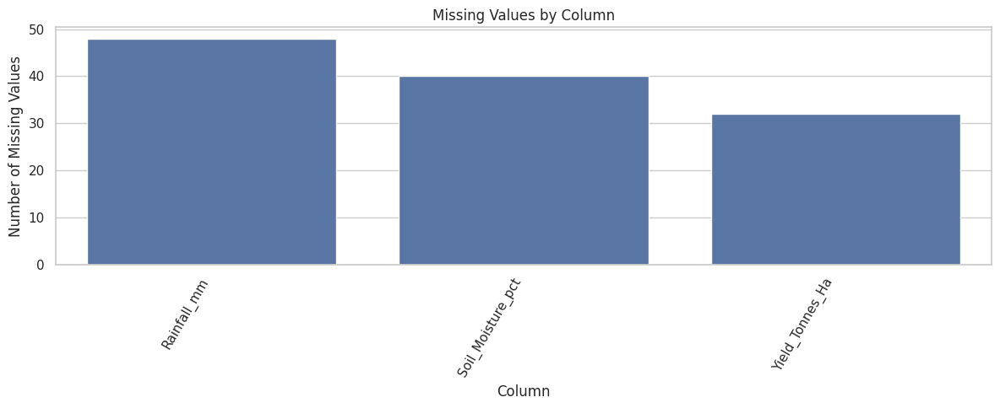

### Season & Crop Distribution
Records are fairly balanced across the three seasons (Kharif, Rabi, Zaid), with Rice and Wheat being the most common crops.

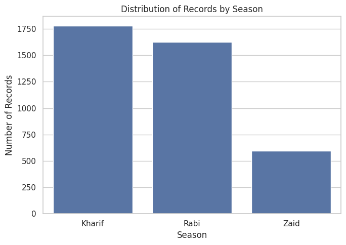

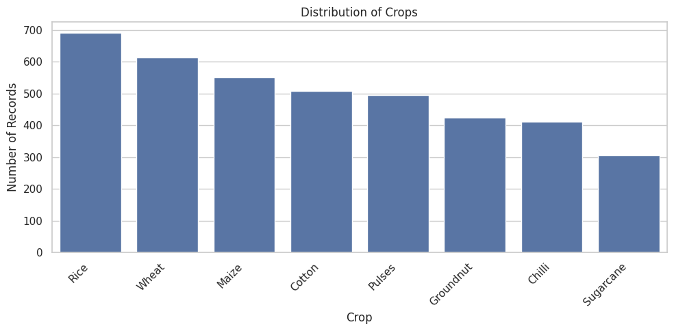

### Yield & Profit Distributions
Both yield and profit are roughly normally distributed, with some high-value outliers representing very profitable farms.

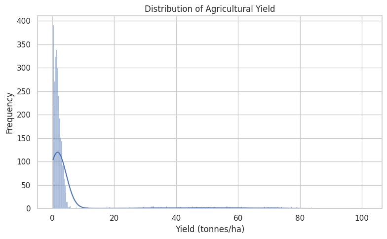

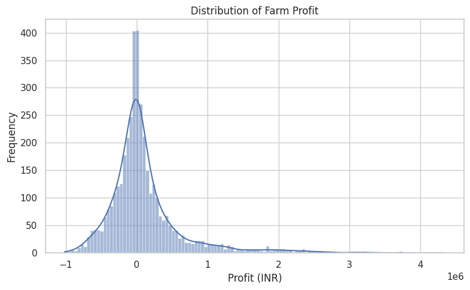

### Season vs Yield and Profit
Yield and profit vary noticeably by season — boxplots show different median yields and spreads per season, and average profit per season is compared directly.

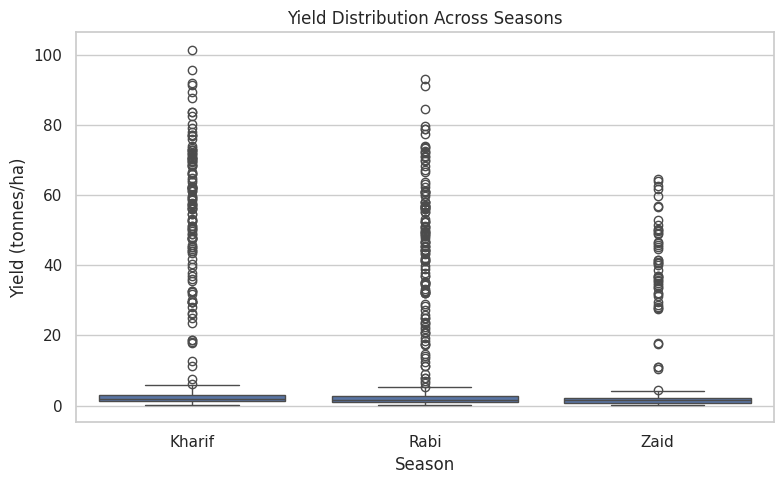

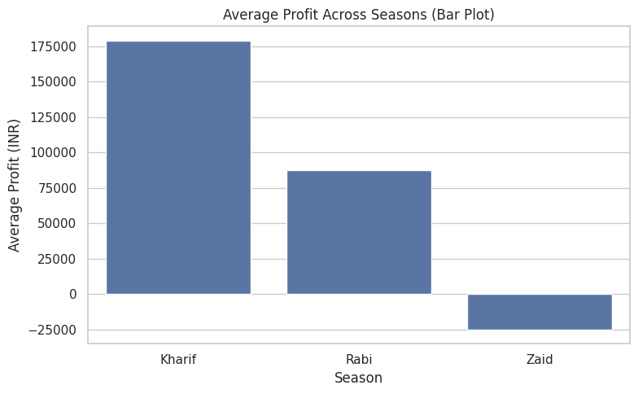

### Water Usage by Season
Water consumption differs sharply by season, reflecting irrigation demand in drier periods.

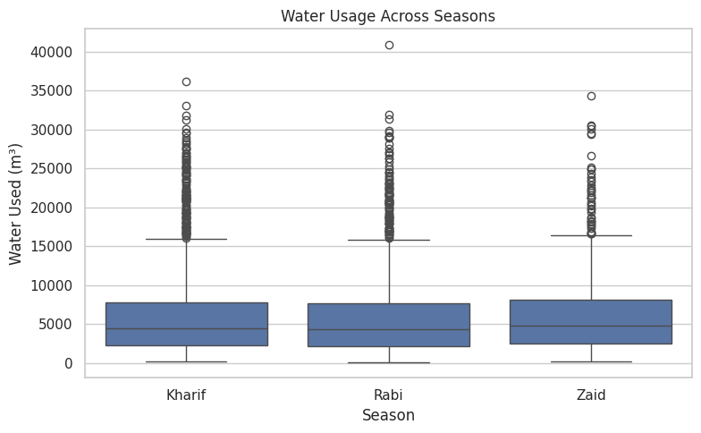

### Rainfall vs Yield
Rainfall alone is not a strong predictor of yield — irrigation method and crop type play a big role.

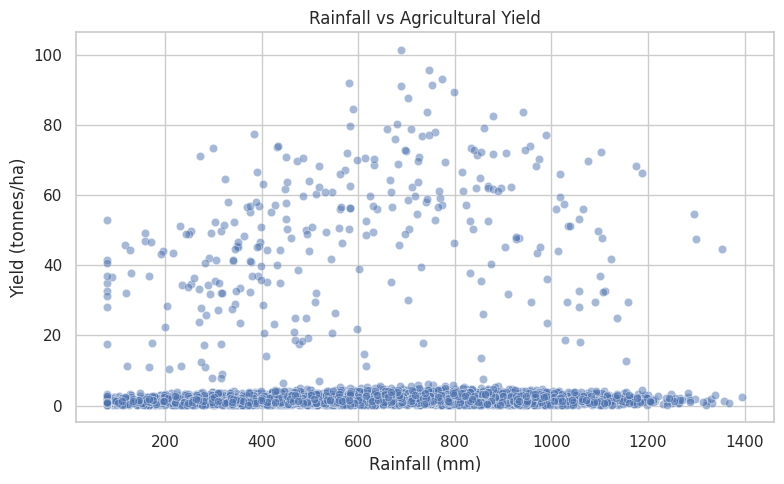

### Crop Yield by Season
Grouped boxplots show which crops perform best in which season — a key insight for crop planning.

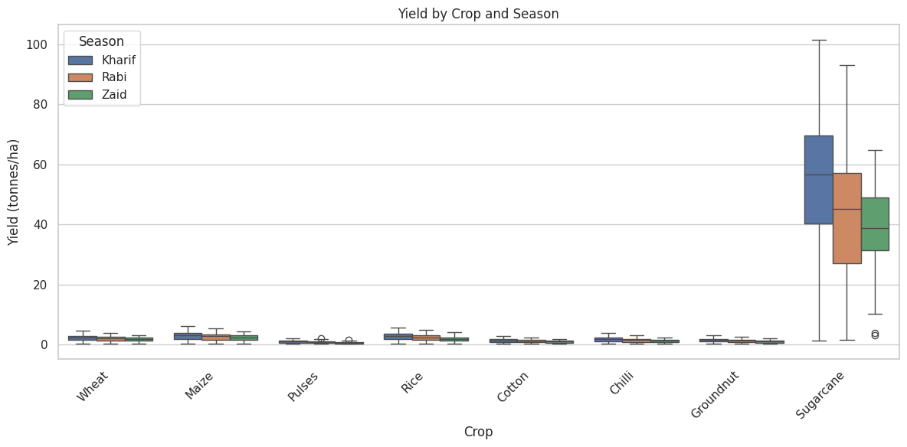

### Irrigation Method vs Yield
Drip and sprinkler irrigation generally deliver more consistent yields than flood or rainfed methods, especially in dry seasons.

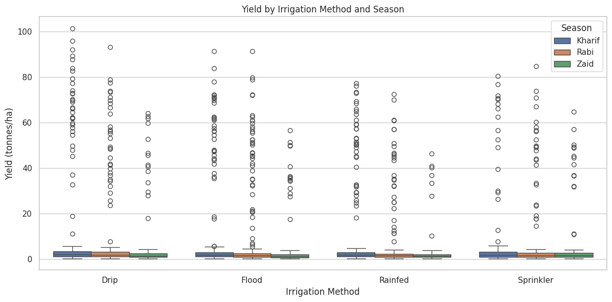

### Pair Plot of Environmental Metrics
Relationships between temperature, rainfall, humidity, and soil moisture, colored by season, showing clear seasonal clustering.

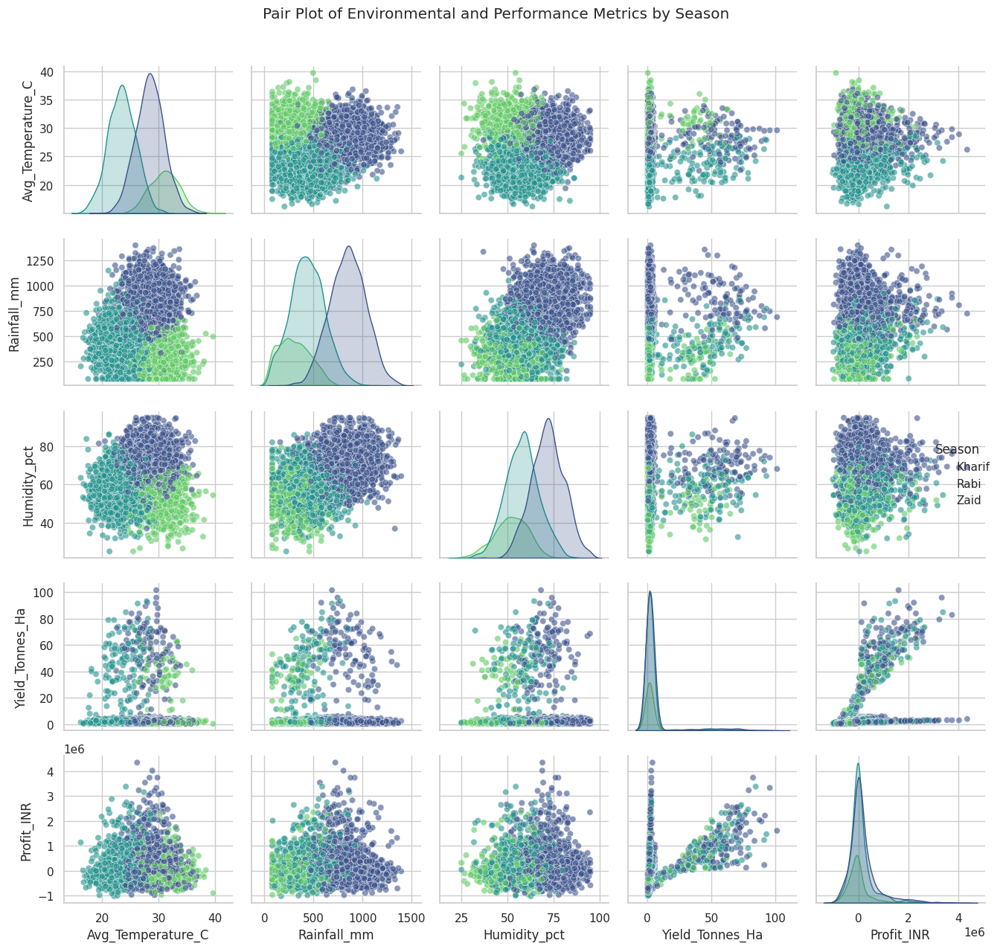

### Correlation Heatmap
`Farm_Area_Hectares` correlates strongly with `Production_Tonnes`; `Yield_Tonnes_Ha` and `Market_Price_INR_Tonne` drive `Profit_INR`. Weather variables show weaker direct correlations with yield.

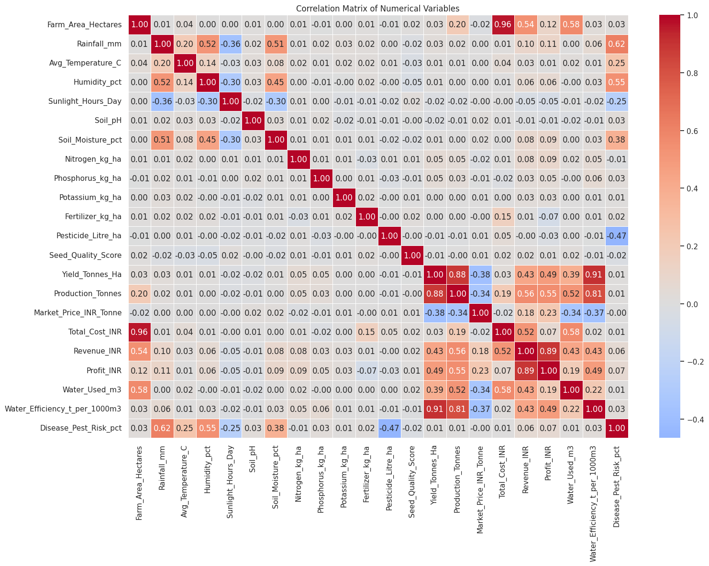

---

## Key Findings

1. **Season matters:** Yield, profit, and water usage all vary significantly across Kharif, Rabi, and Zaid seasons.
2. **Irrigation method drives consistency:** Drip/sprinkler irrigation produces steadier yields than flood or rainfed farming.
3. **Crop selection is seasonal:** Certain crops clearly outperform others within specific seasons.
4. **Rainfall is not enough:** Rainfall alone poorly predicts yield — managed irrigation and crop choice matter more.
5. **Profit follows area and price:** Larger farms and high-price crops dominate total revenue and profit.

---

## Tools & Libraries

- **Python 3** with **Jupyter Notebook** (Google Colab)
- **pandas**, **numpy** — data manipulation
- **matplotlib**, **seaborn** — visualization
- **scikit-learn** — used for modeling experiments at the end of the notebook

## How to Run

1. Open `Seasonal_Agriculture_Performance_Analysis_1.ipynb` in Jupyter or Google Colab.
2. Place the dataset CSV (`seasonal_agriculture_performance_dataset.csv`) in the working directory and update `file_path` in the second cell if needed.
3. Run all cells top to bottom — every chart shown above is generated by the notebook.
